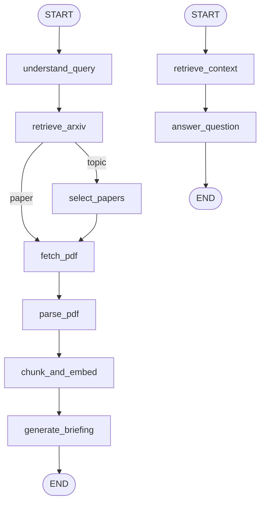

# Autonomous arXiv Paper Digest & QA Agent

**Overview video:** [arXiv Research Agent](https://drive.google.com/file/d/1W_lPZXEAkAZJgd5I5MsotX43Qopn6_3T/view?usp=drive_link)

## 1. Overview

Interactive CLI agent that:

- accepts an **arXiv ID/URL** or a **natural-language research topic**
- retrieves paper metadata via the **official arXiv API** (no HTML scraping)
- downloads and caches the PDF locally
- parses text with **PyMuPDF**, then **chunks** and **embeds** the paper
- stores vectors in **local persistent ChromaDB**
- generates an **executive briefing** with **OpenAI** (`gpt-5-mini` by default)
- supports **retrieval-grounded QA** over the indexed paper
- returns `grounded=False` with empty sources when retrieved evidence is insufficient (does not invent unsupported facts)

**Scope note:** topic search ranks multiple candidates but processes **one paper** end-to-end. Multi-paper synthesis is not implemented.

## 2. Architecture

Two LangGraph workflows share `AgentState`:

| Graph | Export | Role |
|---|---|---|
| Digest | `graph` | Query → retrieve → PDF → index → briefing |
| QA | `qa_graph` | Question → retrieve chunks → grounded answer |

QA has **no infinite loop**. The CLI calls `qa_graph` once per user question and keeps `conversation_history` for session memory (evidence remains retrieved chunks, not prior answers).



**Digest path**

```text
START
  → understand_query
  → retrieve_arxiv
  → conditional routing
       ├── paper → fetch_pdf
       └── topic → select_papers → fetch_pdf
  → parse_pdf
  → chunk_and_embed
  → generate_briefing
  → END
```

**QA path**

```text
START
  → retrieve_context
  → answer_question
  → END
```

## 3. Why LangGraph?

LangGraph provides:

- **explicit nodes** for each pipeline step
- **edges** and **conditional routing** (paper vs topic; early exit on error)
- **shared `AgentState`** passed between nodes
- **separate digest and QA graphs** so briefing and Q&A stay modular
- **controlled error propagation** via `state["error"]` → short-circuit to `END`

Business logic lives in independent services under `app/services/`. `app/graph.py` only orchestrates those services.

## 4. State

Shared state is `AgentState` in `app/state.py` (`TypedDict`, `total=False`):

| Field | Purpose |
|---|---|
| `user_query` | Original user input (normalized to an arXiv ID when detected) |
| `query_type` | `"paper"` or `"topic"` |
| `papers` | arXiv search candidates |
| `selected_papers` | Ranked topic candidates (top 3) |
| `paper_metadata` | Active paper being processed |
| `pdf_path` | Local cached PDF path |
| `parsed_document` | Parsed text/sections/`page_count` |
| `chunks` | Section-aware document chunks |
| `vector_collection` | Chroma collection name string (e.g. `paper_2401_12345v3`) |
| `briefing` | Executive briefing (`Briefing` model) |
| `question` | Current QA question |
| `retrieved_chunks` | Chunks retrieved as QA evidence |
| `qa_response` | Grounded answer (`QAResponse`) |
| `conversation_history` | Prior `QAResponse` objects in the session |
| `error` | Human-readable pipeline error, or `None` |

Clients and models (OpenAI, Chroma, Sentence Transformers) are **not** stored in state.

## 5. Components

| Service | Responsibility |
|---|---|
| **ArxivService** | Official `arxiv` Python package; `get_paper()` / `search_papers()`; normalized IDs and `PaperMetadata` |
| **PDFService** | Downloads from `pdf_url`; caches under `data/papers/`; reuses existing files |
| **PDFParser** | PyMuPDF text extraction; simple academic section detection; fails clearly on empty/unreadable PDFs (no OCR) |
| **Chunker** | Section-local chunks (~3200 chars, ~400 overlap); deterministic IDs; section/page metadata |
| **EmbeddingService** | Local Sentence Transformers `all-MiniLM-L6-v2` for documents and queries |
| **VectorStore** | Persistent Chroma under `data/chroma/`; upsert by `chunk_id`; semantic search |
| **LLMService** | OpenAI Responses API; default model `gpt-5-mini` (`OPENAI_MODEL`); structured `Briefing` / grounded QA |

Prompts live in `app/prompts.py`. The CLI is `main.py`.

## 6. Retrieval and Grounding

```text
User question
  → query embedding (same local model)
  → Chroma similarity search (top_k = 3)
  → LLM receives only retrieved chunks
  → answer + grounded flag + cited chunk IDs
  → sources mapped from retrieved chunk metadata
```

Rules enforced in code:

- The answering model does **not** receive the full PDF.
- Cited chunk IDs must exist in the supplied retrieved set; unknown IDs are dropped.
- CLI sources show **section + page(s)**, not raw chunk IDs as the primary citation.
- If `grounded=False`, sources are cleared → CLI shows `Sources: None`.

**Unsupported-question example:**

```text
Question:
What is the author's favorite programming language?

Expected:
Grounded: No
Sources: None
(Answer states the supplied paper context does not contain that information.)
```

## 7. Executive Briefing

`Briefing` fields (CLI labels in parentheses):

| Field | CLI section |
|---|---|
| `summary` | Why this paper matters |
| `problem_statement` | Problem |
| `method` | Method / Approach |
| `key_results` | Key Results / Claims |
| `limitations` | Limitations |
| `follow_up_questions` | Suggested Follow-up Questions |

Briefing context is built from **parsed sections** (bounded length), not the abstract alone. Prompts require paper-grounded follow-ups only.

## 8. Topic Search Design Tradeoff

For topic queries the digest graph:

1. searches up to **10** arXiv candidates  
2. ranks by embedding similarity of **title + abstract** vs the query  
3. keeps the **top 3** in `selected_papers`  
4. downloads/parses/indexes/briefs only the **first** selected paper  

This keeps the assignment within a focused time-box while leaving multi-paper synthesis as a natural extension. It is intentional, not a bug.

## 9. Failure Handling

Nodes catch service failures and set `state["error"]`. Conditional edges then route to `END`. The CLI prints a short **Pipeline Error** block instead of a normal-user traceback.

Implemented failure paths include:

- empty / invalid user query  
- arXiv retrieval / empty topic search  
- paper selection / embedding ranking failure  
- PDF download failure after metadata retrieval  
- unreadable PDF / insufficient extractable text  
- chunking / vector upsert failure  
- missing vector collection for QA  
- LLM briefing or QA failure  

API keys are never logged.

## 10. Project Structure

```text
Arxiv Research Agent/
├── app/
│   ├── __init__.py
│   ├── state.py              # Pydantic models + AgentState
│   ├── graph.py              # LangGraph digest + QA graphs
│   ├── prompts.py            # Briefing / QA prompts
│   └── services/
│       ├── arxiv.py
│       ├── pdf.py
│       ├── pdf_parser.py
│       ├── chunker.py
│       ├── embeddings.py
│       ├── vector_store.py
│       └── llm.py
├── data/
│   ├── papers/               # Cached PDFs (gitignored contents)
│   └── chroma/               # Persistent Chroma DB (gitignored contents)
├── main.py                   # Interactive CLI
├── requirements.txt
├── .env.example
├── .gitignore
└── README.md
```

## 11. Setup

Windows / Git Bash:

```bash
python -m venv .venv
source .venv/Scripts/activate
pip install -r requirements.txt
cp .env.example .env
```

Edit `.env`:

```env
OPENAI_API_KEY=your_api_key_here
OPENAI_MODEL=gpt-5-mini
```

Notes:

- Do not commit a real API key (`.env` is gitignored).
- On first embed, Sentence Transformers downloads `all-MiniLM-L6-v2` locally (may take a minute).

## 12. Run

```bash
python main.py
```

Enter an arXiv ID (for example `2401.12345`), an arXiv URL, or a research topic. After the briefing is shown, ask questions in the QA loop, then type `exit` to quit.

## 13. Example Run

Input paper: **`2401.12345`** (*Distributionally Robust Receive Combining*).

```text
==================================================
 Autonomous arXiv Paper Digest & QA Agent
==================================================

Enter a research topic or arXiv ID:
> 2401.12345

Processing research query...
[OK] Paper retrieved
[OK] PDF downloaded
[OK] PDF parsed
[OK] Document chunked and indexed
[OK] Executive briefing generated

==================================================
 PAPER
==================================================

Title:
Distributionally Robust Receive Combining

Authors:
Shixiong Wang, Wei Dai, Geoffrey Ye Li

arXiv ID:
2401.12345v3

...

==================================================
 EXECUTIVE BRIEFING
==================================================

Why this paper matters
----------------------
This paper develops a distributionally robust receive combining framework
for wireless signal estimation under multiple model uncertainties...
...

Problem
-------
...

Method / Approach
-----------------
• ...
...
```

### QA exchanges

**1. Supported question**

```text
You:
> What problem does the paper address?

Assistant:
The paper addresses receive combining / signal estimation under
distributional uncertainty...
...

Grounded:
Yes

Sources:
• Preamble — page 1
• Introduction — pages ...
• Conclusions — pages ...
```

**2. Unsupported question**

```text
You:
> What is the author's favorite programming language?

Assistant:
The supplied paper excerpts do not state the author’s favorite
programming language, so this cannot be determined from the
provided context.

Grounded:
No

Sources:
None
```

**3. Reproducibility-style question**

```text
You:
> Is code or supplementary material available to reproduce the results?

Assistant:
...
(If retrieved chunks do not discuss code or supplements, the system
answers that the provided context is insufficient.)

Grounded:
No   # when evidence is absent from retrieved chunks

Sources:
None
```

```text
You:
> exit

Goodbye!
```

## 14. Design Decisions & Tradeoffs

- **Deterministic query classification** (regex/ID detection) instead of an LLM for routing  
- **Official arXiv API** instead of scraping  
- **Local Sentence Transformers embeddings** to avoid embedding API cost and keep vectors on-disk  
- **Local Chroma persistence** under `data/chroma/` with upsert-safe re-runs  
- **LLM isolated in `LLMService`** (OpenAI structured outputs for briefing/QA)  
- **LangGraph orchestration** with separate digest vs QA graphs  
- **Topic mode: rank top 3, process one paper** for assignment time-box  
- **Section/page provenance** for user-facing citations; chunk IDs kept for internal validation  

## 15. Limitations / Future Improvements

- PDF layout can still leave whitespace/hyphenation artifacts after minimal cleanup  
- Scanned/image PDFs are **not** OCR’d and fail with a clear parse error  
- Topic mode does not summarize all selected candidates  
- Multi-paper synthesis / comparison is not implemented  
- Retrieval quality could be evaluated more systematically (e.g. precision@k)  
- Richer citation linking (equations/figures) could be added later  
- Layout-aware or OCR-backed parsing would help difficult PDFs  

## 16. Security / Configuration

- Secrets load from environment / `.env` via `python-dotenv`  
- `.env` is gitignored; `.env.example` contains placeholders only  
- Cached PDFs (`data/papers/*`) and Chroma files (`data/chroma/*`) are gitignored and not required in the repository  
